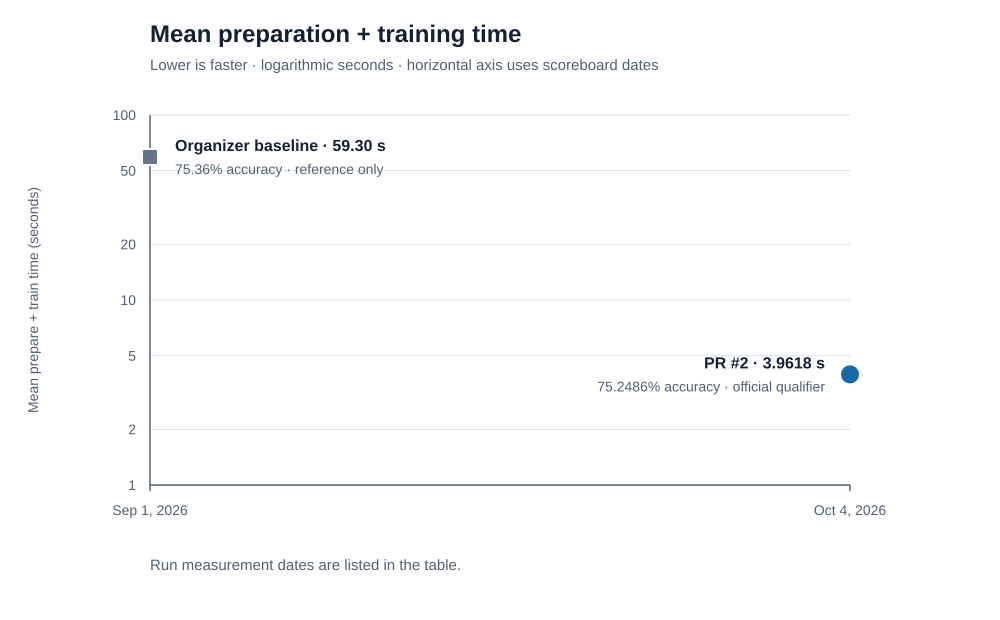

# CIFAR-100 speedrun scoreboard

<!-- Generated from scoreboard.json by `python -m benchmark.render_scoreboard`. -->

Official submissions use 200 trials on NVIDIA A100 80GB PCIe and need at least 75% mean accuracy. Qualifying submissions are ordered by mean preparation + training time; lower is better.

The organizer baseline is a short reference pilot, not a ranked submission. Its timing is an indication only; the run used two trials. Accuracy and timing variation are shown as mean ± sample standard deviation across trials.

| Entry | Submission / attribution | Status | Trials | Mean test accuracy | Mean prepare + train | Submitted / measured |
| ---: | --- | --- | ---: | ---: | ---: | --- |
| 1 | [Organizer ResNet9 baseline](README.md#verified-a100-setup) | Reference only; not ranked | 2/2 (pilot) | 75.3600% ± 0.2828 pp | 59.3045 ± 0.2840 s | — / 2026-10-02 |
| 2 | [Vibecoders / futurebiohackers (PR #2)](https://github.com/AIDDA-Institute/CIFAR-100-speedrun/pull/2) @comersy | Official qualifier; rank 1 | 200/200 | 75.2486% ± 0.2189 pp | 3.9618 ± 0.0252 s | 2026-10-04 / 2026-10-05 |

The baseline pilot ran on an A100 80GB PCIe with four CPU threads, but it used only two trials and is not an official score. Raw seed values are withheld; the JSON stores a hash of each ordered seed list for provenance.

The graph uses each run’s measurement date. PR creation dates are listed separately in the table.

PR #2’s source was frozen and matched to the 200-trial run by file hashes. The run artifact did not contain a Git commit for the harness, so its base commit and exact harness file hashes are recorded in `scoreboard.json`.

For the complete entry metadata, source hashes, and run IDs, see [`scoreboard.json`](scoreboard.json).
